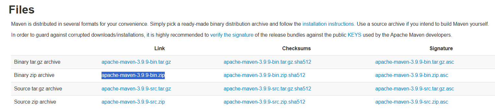
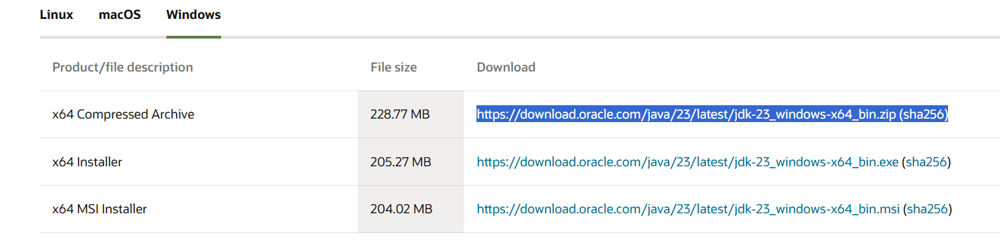
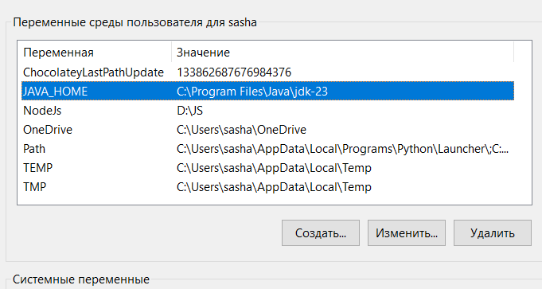
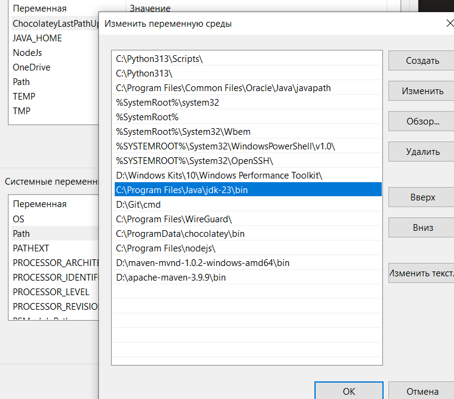
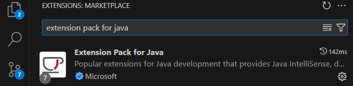
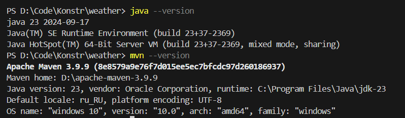
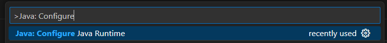
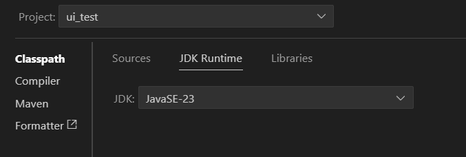

1. Установить Maven отсюда https://maven.apache.org/download.cgi

2. Добавить папку bin в path в системных переменных

3. Установить JDK отсюда https://www.oracle.com/java/technologies/downloads/#jdk23-windows

4. Добавить в переменные среды пользователя переменную JAVA_HOME, в которой хранится путь до папки jdk-23

5. Добавить путь до папки jdk-23/bin в path в системных переменных

6. Установить allure отсюда https://github.com/allure-framework/allure2/releases/tag/2.33.0 - внизу есть zip файл

7. Добавить папук bin в системную переменную Path

8. Открываем VSCode

9. В Extensions устанавливаем Extension Pack for Java

10. Проваливаемся в папку D:\Code\Konstr\weather\ui_test

11. Проверяем, что нет ошибок на запросы

mvn --version

java --version

12. Нажимаем Ctrl + shift + P
Вбиваем Java: Configure Java Runtime

Проверяем, что там JavaSE

12. Ждем, пока прогрузятся все зависимости (около минутки)

13. Запускаем сайт по основной README

14. Переходим в директорию ui_test: cd ui_test

15. Запускает тесты: mvn clean test

16. Запускаем создание отчета Allure: mvn allure:serve