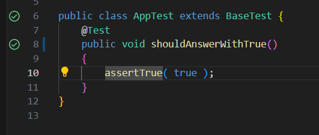

1. Установить Maven отсюда https://maven.apache.org/download.cgi

2. Добавить папку bin в path в системных переменных

3. Установить JDK отсюда https://www.oracle.com/java/technologies/downloads/#jdk23-windows

4. Добавить в переменные среды пользователя переменную JAVA_HOME, в которой хранится путь до папки jdk-23

5. Добавить путь до папки jdk-23/bin в path в системных переменных

6. Открываем VSCode

7. В Extensions устанавливаем Extension Pack for Java

8. Проваливаемся в папку D:\Code\Konstr\weather\ui_test

9. Проверяем, что нет ошибок на запросы

mvn --version

java --version

10. Нажимаем Ctrl + shift + P
Вбиваем Java: Configure Java Runtime

Проверяем, что там JavaSE

11. Ждем, пока прогрузятся все зависимости (около минутки)

12. Запускаем сайт по основной README

13. Заходим в файл AppTest.java и запускаем тест по кнопочке напротив теста

